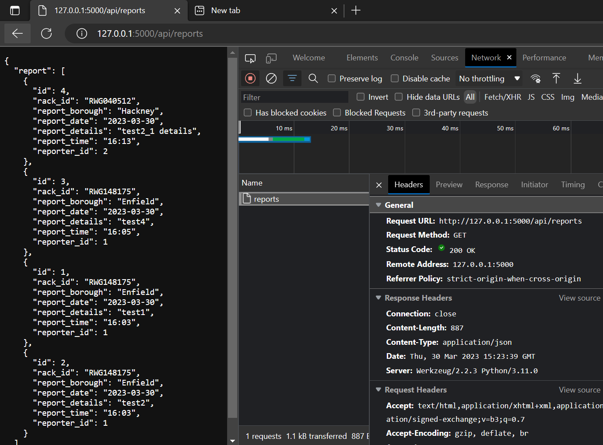
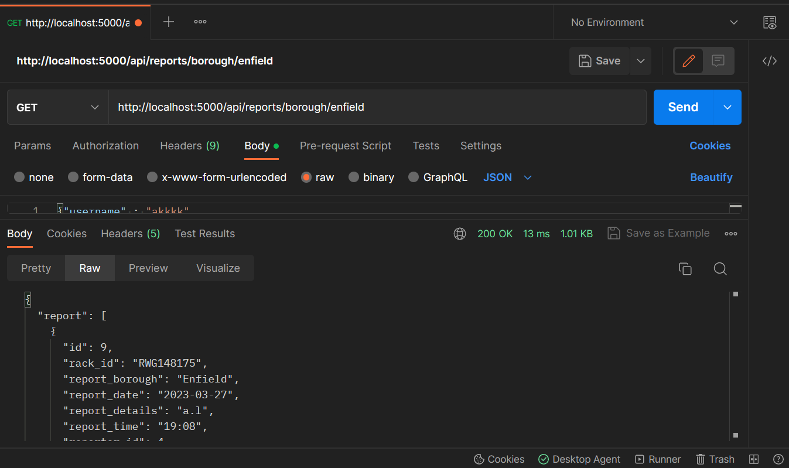
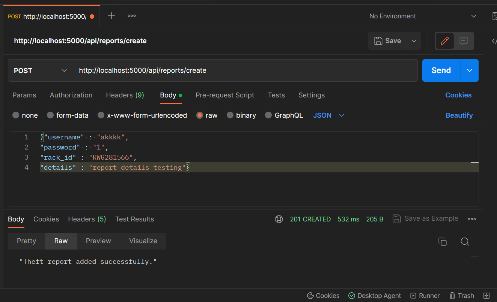
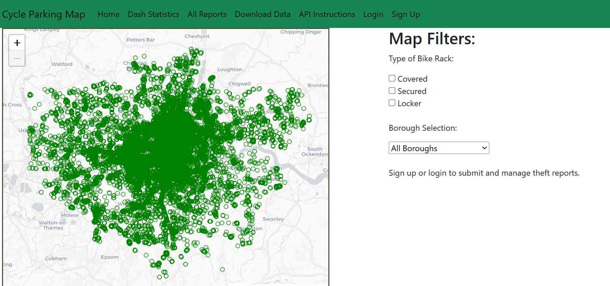
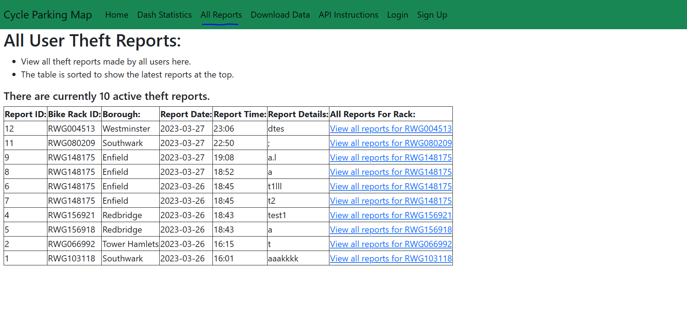
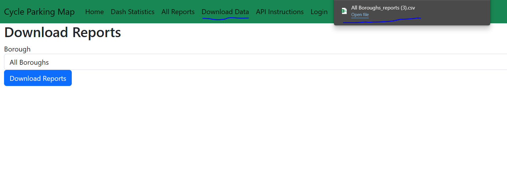

# COMP0034 Coursework 2

### This README contains

[- General information on the flask app and API](#general-information)  
[- Walk through of the flask website/app usage](#example-usage-of-flask-app)  
[- API Routes](#api-routes)  
[- Testing](#testing)

## General information
1. Run the following commands from the main [/comp0034-cw2-g-team11](/) directory:

    pip install -r requirements.txt
    flask --app "main_flask_app:create_flask_app('main_flask_app.config.Config')" run

2. There are three blueprints being used, [auth_bp](main_flask_app/auth_bp/), [main_bp](main_flask_app/main_bp/) and [api_bp](main_flask_app/api_bp/). Auth_bp manages the account creation and management of users, while main_bp handles the rest of the user experience like viewing, creating and managing theft reports. The api_bp manages the API routes.

3. The Flask app is initialised in the [__init__.py](/main_flask_app/__init__.py) file.

4. User authorisation has been setup with SHA256 encryption for passwords. Users can create theft reports which can be viewed by other users. Users can also edit or delete their reports. Users are also able to change their passwords.

5. When creating the main app, a library called Leaflet was used, the neccesasary map marker variables and information were loaded in using Flask.

6. All forms were made using Flask.

7. The dataset is stored on the [dataset_cycle_parking.db](/main_flask_app/data/dataset_cycle_parking.db) database file and loaded from there when needed. In this case it is reloaded each time the flask server starts with the [csv_to_sql.py](/main_flask_app/data/csv_to_sql.py) being used to make sure the dataset is available in SQL form (it does not need to be reloaded in reality but if the database file or dataset tables are missing it ensures that they are available when the server runs). The engine and base type were needed to be declared too in SQLAlchemy in order for the dataset tables to be accessed by flask.

8. The API has GET, POST, PUT and DELETE routes. These were all tested using pytest in the [Testing](#testing) section.  
Below is an example of an API response on a browser (the Content-Type is "application/json"):  

The API allows for the creation of users and the creation, deletion and editing of reports. Some screenshots were also taken on the API testing website "Postman.co" and these can be found in the [API Postman.co screenshots folder](/screenshots/api_postman.co_screenshots/).  
Below is are examples of API tests on Postman.co:

  
  

All the API routes can be found in the [api_bp/api_routes.py](/main_flask_app/api_bp/api_routes.py) file.

9. The API is used on the site by grabbing report data (for a specific borough or all borough) and creating a downloadable CSV file with that data.

10. The [dash app](/main_flask_app/dash_app_cycling/) from COMP0034-CW1 has also been added in as a page.

11. Different configurations are used for normal operations and for testing purposes. These can be found in the [main_flask_app/config.py](/main_flask_app/config.py) file.

## Example usage of flask app
(all screenshots can be found in the [site usage screenshots folder.](/screenshots/site_app_usage_screenshots/))

Home view (not logged in):  

All reports page:  

Download reports page which uses API to get reports (downloaded file shown):  
  

Dash statistics page:  
  

Sign up page:  
  

Login page:  
  

Page shown after logging in:  

Logged in view of home page showing the map. Users can click on markers to start reports:  
  

Users can manage reports (edit details or delete them):

Users can change their passwords:  
  

Anyone can view reports for specific bike racks:
  

## API Routes
This information is also available on the website itself on the API Instructions page.

### API GET Routes:
http://127.0.0.1:5000/api/reports - Get all reports.

http://127.0.0.1:5000/api/reports/borough/[Enter_borough_name] - Get all reports for a specific borough.

http://127.0.0.1:5000/api/reports/rack/[Enter_rack_ID] - Get all reports for a specific bike rack.

http://127.0.0.1:5000/api/reports/user/[Enter_username] - Get all reports made by a specific user.

### API POST Routes:
http://127.0.0.1:5000/api/reports/create - Create a new report.  
JSON request body format for this request:  
{"username" : "Enter username of report creator",  
"password" : "Enter password of report creator",  
"rack_id" : "Enter bike rack ID",  
"details" : "Enter report details"}

http://127.0.0.1:5000/api/user/sign_up  
Sign up a new user.  
JSON request body format for this request:  
{"username" : "Enter username",  
"password" : "Enter password"}

### API PUT Routes:

http://127.0.0.1:5000/api/reports/edit/[Enter_report_ID] - Edit an existing report.  
JSON request body format for this request:  
{"username" : "Enter username of report creator",  
"password" : "Enter password of report creator",  
"details" : "Enter new/updated report details"}

http://127.0.0.1:5000/api/user/change_password - Changing a current user's password.  
JSON request body format for this request:  
{"username" : "Enter username",  
"current_password" : "Enter current password",  
"new_password" : "Enter new password"}

### API DELETE Routes:

http://127.0.0.1:5000/api/reports/delete/[Enter_report_ID]  
Delete an existing report.  
JSON request body format for this request:  
{"username" : "[Enter username of report creator]",  
"password" : "[Enter password of report creator]"}

## Testing
1. Run the following command from the main [/comp0034-cw2-g-team11](/) directory to initiate testing:

    pytest -v -W ignore::DeprecationWarning  

2. The tests for the API routes can be found in the [tests/test_api.py](/testing/test_api.py) file.

3. A copy of the clean [cycle_parking.db](/main_flask_app/data/cycle_parking.db) database file is used for testing purposes. This test database is generated as the [test.db](/tests/test.db) file. The dataset database is also used.